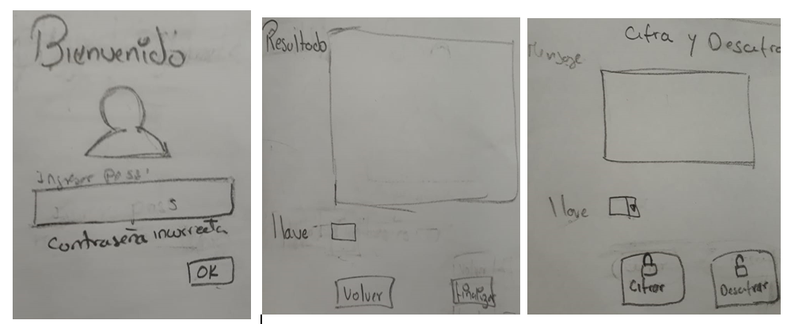

- Investigación UX:
  - Explicar quiénes son los usuarios y los objetivos en relación con el producto.
  - Explicar cómo el producto soluciona los problemas/necesidades de dichos usuarios.
  - Luego colocarás la foto de tu primer prototipo en papel.
  - Agregar un resumen del feedback recibido indicando las mejoras a realizar.
  - Imagen del prototipo final en Balsamiq.

# SISTEMA DE CIFRADO Y DESCIFRADO PARA TUS MENSAJES
  Esta aplicacion permitira el envio de informacion confidencial entre 2 o mas personas a traves del
  correo electrónico.

  **`Investigacion UX`**
  Debido al intercambio de mensaje que se dan en las diferentes areas de trabajo de una agencia bancaria,
  se va crear una aplicacion que permitira encriptar y desencriptar los mensajes.
  Cierta area del sistema bancario envia a traves del correo electronico al area de call center la cartera de 
  clientes con mayor moviento bancario para que ellos puedan ofrecer a dichos clientes algunos servicios y asi
  poder mantener a dichos clientes como activos. La aplicacion va permitir ingresar el texto y luego podra 
  ser cifrado o descifrado con una respectiva clave, si el texto fue cifrado se tendra que copiar dicho texto 
  cifrado para ser pegado en nuestra bandeja de salida del correo electronico, tambien se enviara al receptor
  la clave para que pueda descifrarlo en la aplicacion web. 
  
  

  El feeback recibido por mis compañeras fue que al momento de obtener el texto cifrado hacerle recordar al usuario
  la clave que ha utilizado para encriptar el texto y asi poder tener presente al momento enviarlo.
